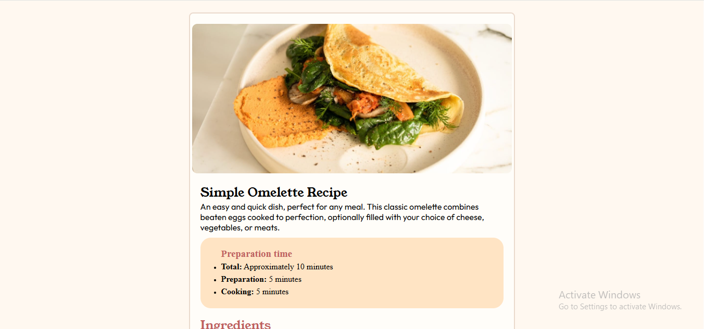

# Frontend Mentor - Recipe page solution

This is my solution to the Frontend Mentor Recipe Page challenge.
I built this project using only HTML and CSS to practice responsive layouts, spacing, typography, lists, tables, and Flexbox.

## Overview

### The challenge

Users should be able to:

* View the optimal layout depending on their device screen size
* See a clean and responsive recipe page design
* Read recipe instructions, ingredients, and nutrition information clearly


## Screenshot




### Links

* Solution URL: Coming soon
* Live Site URL: Coming soon (GitHub Pages)


## My process

### Built with

* Semantic HTML5 markup
* CSS custom properties
* Flexbox
* Responsive design
* Mobile-first workflow
* Media queries


## What I learned

Through this project, I practiced and improved my understanding of:

* Flexbox layouts
* Responsive web design
* CSS spacing using margin and padding
* Lists and tables in HTML
* Styling images and sections
* Using custom fonts with `@font-face`
* Mobile responsiveness with media queries

Example CSS I used:

```css
body{
    display:flex;
    justify-content:center;
    align-items:center;
    min-height:100vh;
}
```

I also learned how to structure a clean recipe page layout and make it responsive for mobile devices.

---

## Continued development

In future projects, I want to improve my skills in:

* Advanced responsive layouts
* CSS animations
* JavaScript interactivity
* Better UI/UX design
* React and Next.js frontend development

---

## Useful resources

* Frontend Mentor
* MDN Web Docs
* CSS Flexbox Guide

---

## Author

* Name - Karthikeya
* GitHub - https://github.com/Karthikeya-JustForKnowing
* Frontend Mentor - Add your Frontend Mentor profile later

---

## Acknowledgments

Thanks to Frontend Mentor for providing beginner-friendly frontend challenges that help developers practice real-world UI development.
