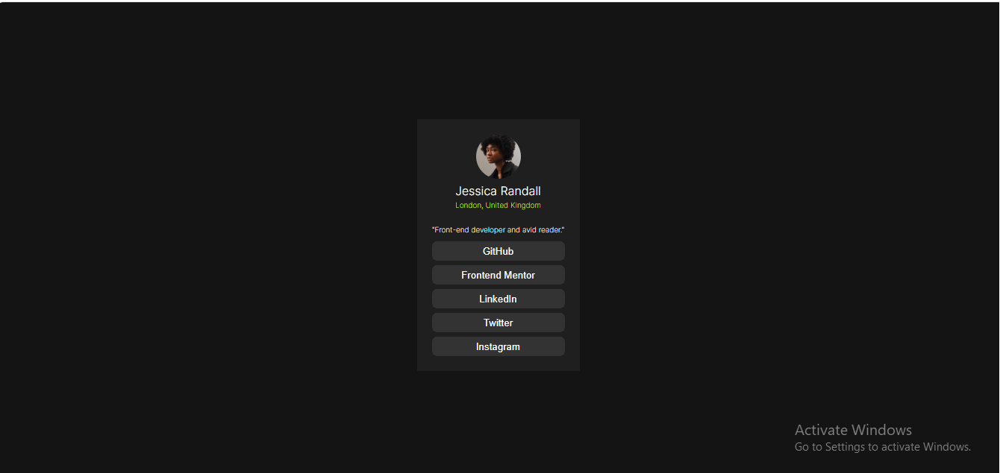

# Frontend Mentor - Social Links Profile Solution

This is my solution to the Frontend Mentor Social Links Profile challenge.
I completed this project to improve my HTML and CSS skills and to get more comfortable with building responsive UI designs.

## Overview

### The challenge

Users should be able to:

* See hover effects on all social link buttons
* View the layout properly on different screen sizes

---

### Screenshot



---

### Links

* Live Site URL: https://karthikeya-justforknowing.github.io/frontend_mentor_projects/social-links-profile-main/

---

## My Process

### Built With

* HTML5
* CSS3
* Flexbox
* Responsive Design
* Custom Hover Effects

---

## What I Learned

While building this project, I learned:

* How to center elements using Flexbox
* How `justify-content` and `align-items` work
* How to create hover animations using `transform` and `transition`
* How to use HSL colors in CSS
* Better understanding of spacing, sizing, and modern UI styling

One thing I liked learning was this hover effect:

```css
button:hover{
  background: hsl(75, 94%, 57%);
  color: black;
  transform: translateY(-2px);
}
```

It makes the buttons feel more interactive and modern.

---

## Continued Development

In future projects, I want to improve:

* Responsive layouts
* CSS animations
* Better UI design skills
* Writing cleaner CSS code
* Learning JavaScript

---

## AI Collaboration

I used ChatGPT while building this project to:

* Understand CSS properties
* Learn hover effects and transitions
* Fix styling issues
* Understand Flexbox better
* Improve the overall UI design

It helped me understand concepts step by step instead of only giving code.

---

## Author

* Frontend Mentor - @@Karthikeya-JustForKnowing
* GitHub - https://github.com/@Karthikeya-JustForKnowing


---

## Acknowledgments

Thanks to Frontend Mentor for providing beginner-friendly projects that help developers practice real frontend skills.
